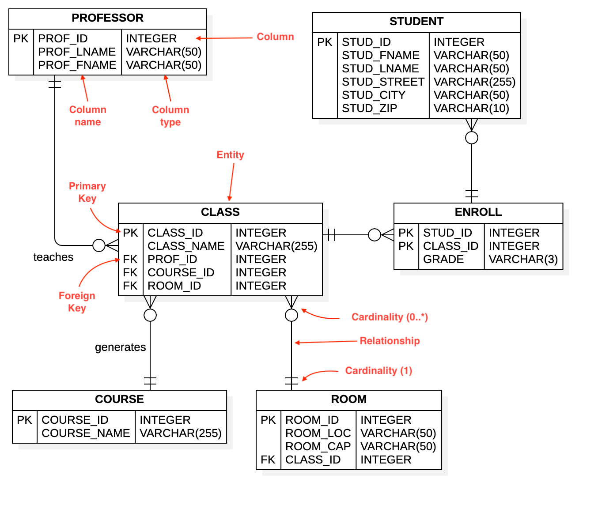

# Entity-Relationship Diagram



## Create Entity-Relationship Diagram

To create a Entity-Relationship Diagram:

1. Select first an element where a new Entity-Relationship Diagram to be contained as a child.
2. Select **Model \| Add Diagram \| ER Diagram** in Menu Bar or select **Add Diagram \| ER Diagram** in Context Menu.

## Data Model

To create a Data Model \(model element only\) by Menu:

1. Select an Element where a new Data Model to be contained.
2. Select **Model \| Add \| Data Model** in Menu Bar or **Add \| Data Model** in Context Menu.

## Entity

To create an Entity:

1. Select **Entity** in **Toolbox**.
2. Drag on the diagram as the size of Entity.

To create a Entity \(model element only\) by Menu:

1. Select a Data Model where a new Entity to be contained.
2. Select **Model \| Add \| Entity** in Menu Bar or **Add \| Entity** in Context Menu.

You can use **QuickEdit** for Entity by double-click or press `Enter` on a selected Entity.

* **Name** : Enter name.
* **Add Note** : Add a linked note.
* **Add Column** \(`Ctrl+Enter`\) : Add a column.
* **Add One to One** : Add an one-to-one relationship with an entity.
* **Add One to Many** : Add an one-to-many relationship with an entity.
* **Add Many to Many** : Add an many-to-many relationship with an entity.

To suppress Columns, see [Suppress Columns](../user-guide/formatting-diagram.md#suppress-columns).

## Column

To add a Column:

1. Select an Entity.
2. Select **Model \| Add \| Column** in Menu Bar or **Add \| Column** in Context Menu.

You can use **QuickEdit** for Column by double-click or press `Enter` on a selected Column.

* **Column Expression** : Edit column expression.

  _Syntax of Column Expression_

  ```text
  column ::= name [ ':' type ] [ '(' length ')' ]
  name ::= (identifier)
  type ::= (identifier)
  length ::= (string)
  ```

* **Primary Key** : Check whether the column is primary key or not.
* **Add** \(`Ctrl+Enter`\) : Add one more column in the below.
* **Delete** \(`Ctrl+Delete`\) : Delete the column
* **Move Up** \(`Ctrl+Up`\) : Move the column up.
* **Move Down** \(`Ctrl+Down`\) : Move the column down.

## Relationship

To create a Relationship:

1. Select **One-to-One Relationship**, **One-to-Many Relationship** or **Many-to-Many Relationship** in **Toolbox**.
2. Drag from an entity and drop on another entity.

You can use **QuickEdit** for Relationship by double-click or press `Enter` on a selected Relationship.

* **Name** : Enter name.
* **Identifying** : Check whether the relationship is identifying or not.
* **Add Note** : Add a linked note.

You can also use **QuickEdit** for Relationship End by double-click at the end side of a Relationship.

* **Name** : Enter name.
* **Cardinality** : Select cardinality of the selected relationship end.

