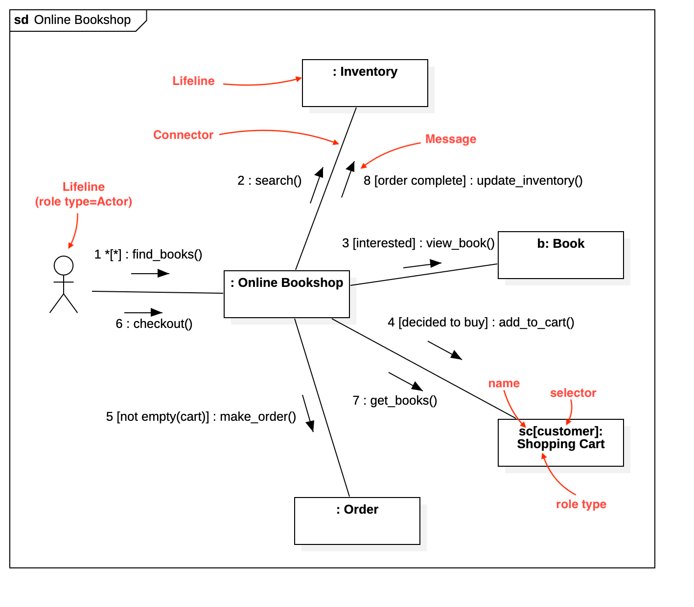

# Communication Diagram



## Create Communication Diagram

To create a Communication Diagram:

1. Select first an element where a new Communication Diagram to be contained as a child.
2. Select **Model \| Add Diagram \| Communication Diagram** in Menu Bar or select **Add Diagram \| Communication Diagram** in Context Menu.

> **See also**
>
> [UML Communication Diagram](http://www.uml-diagrams.org/communication-diagrams.html) - For more information about UML Communication Diagram.

You can show or hide sequence numbers of messages. To show or hide sequence numbers of message:

1. Check or Uncheck `showSequenceNumber` property of **Sequence Diagram** or **Communication Diagram**.

## Lifeline

To create a Lifeline:

1. Select **Lifeline** in **Toolbox**.
2. Drag on the diagram as the size of Lifeline.

To create a Lifeline from a Classifier \(Class, Interface, etc.\) by Drag-and-Drop:

1. Drag a Classifier from **Explorer**.
2. Drop on the diagram.

You can use **QuickEdit** for Lifeline by double-click or press `Enter` on a selected Lifeline.

* **Lifeline Expression** : Edit lifeline expression.

  _Syntax of Lifeline Expression_

  ```text
  lifeline ::= [ '<<' stereotype `>>` ] [ visibility ] name [ '[' selector ']' ] [ ':' type ]
  stereotype ::= (identifier)
  visibility ::= '+' | '#' | '-' | '~'
  name ::= (identifier)
  selector ::= (string)
  type ::= (identifier)
  ```

* **Visibility** : Change visibility property.
* **Add Note** : Add a linked note.
* **Add Constraint** : Add a constraint.
* **Select Type** : Select a type of the lifeline.
* **Create Type** : Create a Class as a type of the lifeline.
* **Add Connected Lifeline** : Add a lifeline with a connector.
* **Add Create Message with Lifeline** : Add a create message with a lifeline.
* **Add Self Connector** : Add a self connector.
* **Add Forward Message** : Add a forward message with a connected lifeline.
* **Add Reverse Message** : Add a reverse message with a connected lifeline.

## Connector

To create an Connector \(or Self Connector\):

1. Select **Connector** \(or **Self Connector**\) in **Toolbox**.
2. Drag from a Lifeline and drop on another Lifeline. \(Just click on a Lifeline if you want to create a Self Connector.\)

You can use **QuickEdit** for Connector by double-click or press `Enter` on a selected Connector.

* **Name Expression** : Edit name expression.

  _Syntax of Name Expression_

  ```text
  expression ::= [ '<<' stereotype `>>` ] [ visibility ] name
  stereotype ::= (identifier)
  visibility ::= '+' | '#' | '-' | '~'
  name ::= (identifier)
  ```

* **Visibility** : Change visibility property.
* **Navigability** : Change navigability property.
* **Add Forward Message** : Add a forward message on the connector.
* **Add Reverse Message** : Add a reverse message on the connector.

## Message

To create a Forward Message:

1. Select **Forward Message** in **Toolbox**.
2. Click on a Connector.

To create a Reverse Message:

1. Select **Reverse Message** in **Toolbox**.
2. Click on a Connector.

You can use custom sequence numbers instead of auto-generated integer sequence numbers.

1. Enter sequence number for each Message's `sequenceNumber` property.
2. Change `sequenceNumbering` property of **Sequence Diagram** or **Communication Diagram** to `custom`.

You can use **QuickEdit** for Message \(See [Message](sequence-diagram.md#message)\).

