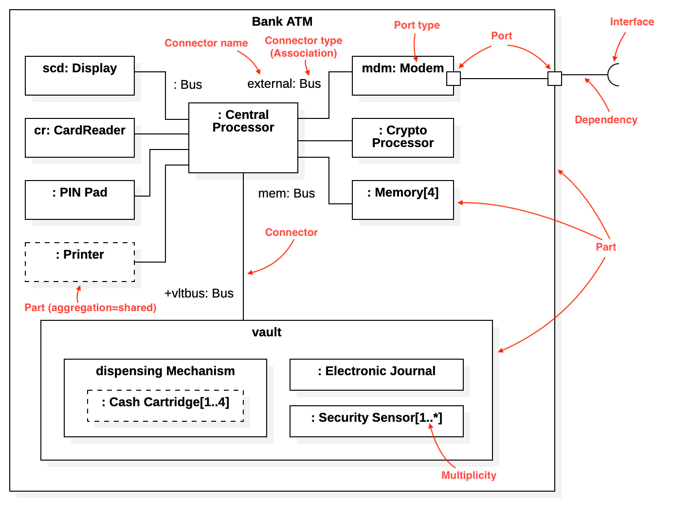

# Composite Structure Diagram



## Create Composite Structure Diagram

To create a Composite Structure Diagram:

1. Select first an element where a new Composite Structure Diagram to be contained as a child.
2. Select **Model \| Add Diagram \| Composite Structure Diagram** in Menu Bar or select **Add Diagram \| Composite Structure Diagram** in Context Menu.

> **See also**
>
> [UML Composite Structure Diagram](http://www.uml-diagrams.org/composite-structure-diagrams.html) For more information about UML Composite Structure Diagram.

## Collaboration

To create a Collaboration:

1. Select **Collaboration** in **Toolbox**.
2. Drag on the diagram as the size of Collaboration.

To create a Collaboration \(model element only\) by Menu:

1. Select an Element where a new Collaboration to be contained.
2. Select **Model \| Add \| Collaboration** in Menu Bar or **Add \| Collaboration** in Context Menu.

You can use **QuickEdit** for Model Element \(See [Model Element](class-diagram.md#model-element)\).

## Port

To create a Port:

1. Select **Port** in **Toolbox**.
2. Click on the element \(e.g. Class\) where Port to be contained.

To create a Port \(model element only\) by Menu:

1. Select an Element where a new Port to be contained.
2. Select **Model \| Add \| Port** in Menu Bar or **Add \| Port** in Context Menu.

You can use **QuickEdit** for Port by double-click or press `Enter` on a selected Port.

* **Name Expression** : Edit name expression.

  _Syntax of Name Expression_

  ```text
  expression ::= [ '<<' stereotype `>>` ] [ visibility ] name
  stereotype ::= (identifier)
  visibility ::= '+' | '#' | '-' | '~'
  name ::= (identifier)
  ```

* **Visibility** : Change visibility property.
* **Add Note** : Add a linked note.
* **Add Constraint** : Add a constraint.
* **Select Type** : Select a Classifier and assign it to type property.
* **Create Type** : Create a Class and assign it to type property.
* **Add Provided Interface** : Add a provided interface.
* **Add Required Interface** : Add a required interface.
* **Add Connected Part** : Add a connected part.

## Part

To create a Part:

1. Select **Part** in **Toolbox**.
2. Click on the element \(e.g. Class\) where Part to be contained.

You can use **QuickEdit** for Port \(See [Port](composite-structure-diagram.md#port)\).

> **Note**
>
> Actually, Part is equivalent to Attribute but represented differently on diagrams.

## Connector

To create an Connector:

1. Select **Connector** in **Toolbox**.
2. Drag from an element \(e.g. Port\) and drop on another element \(e.g. Part\).

You can use **QuickEdit** for Relationship \(See [Relationship](class-diagram.md#relationship)\).

## Collaboration Use

To create a Collaboration Use:

1. Select **Collaboration Use** in **Toolbox**.
2. Drag on the diagram as the size of Collaboration Use.

You can use **QuickEdit** for Model Element \(See [Model Element](class-diagram.md#model-element)\).

## Role Binding

To create an Role Binding:

1. Select **Role Binding** in **Toolbox**.
2. Drag from a Collaboration Use and drop on an element \(e.g. Part\).

You can use **QuickEdit** for Relationship \(See [Relationship](class-diagram.md#relationship)\).

