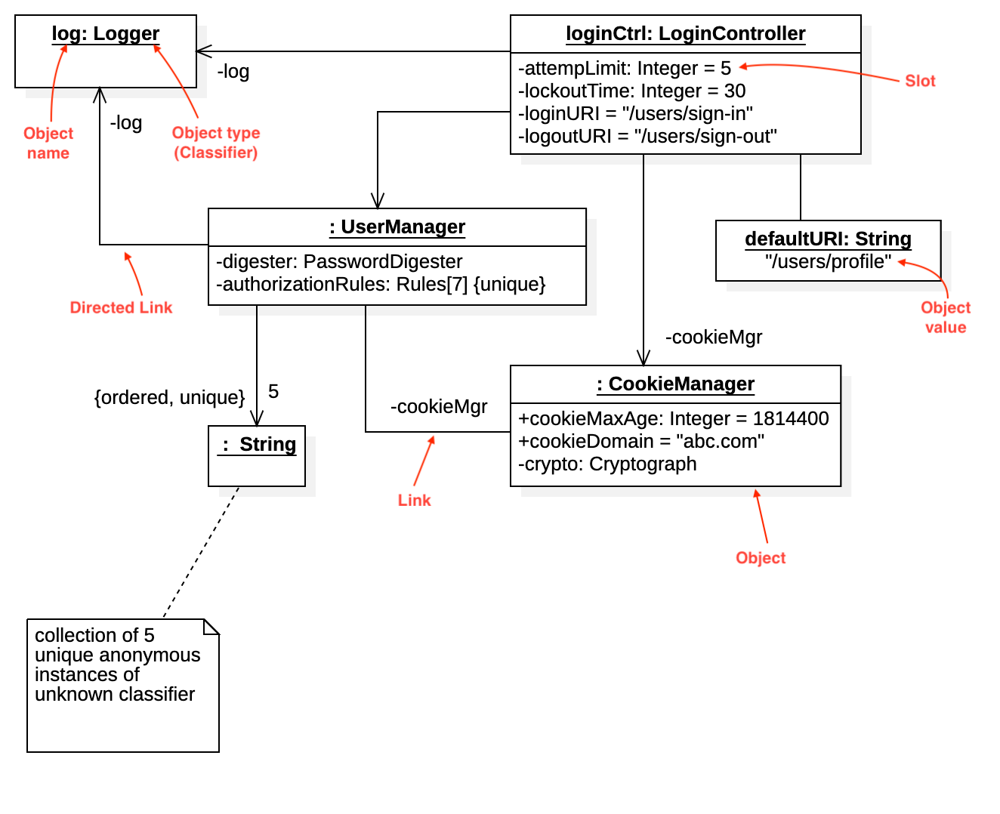

# Object Diagram



## Create Object Diagram

To create a Object Diagram:

1. Select first an element where a new Object Diagram to be contained as a child.
2. Select **Model \| Add Diagram \| Object Diagram** in Menu Bar or select **Add Diagram \| Object Diagram** in Context Menu.

> **See also**
>
> [UML Object Diagram](http://www.uml-diagrams.org/class-diagrams-overview.html#object-diagram) - For more information about UML Object Diagram.

## Object

To create a Object:

1. Select **Object** in **Toolbox**.
2. Drag on the diagram as the size of Object.

You can use **QuickEdit** for Object by double-click or press `Enter` on a selected Object.

* **Name Expression** : Edit name expression.

  _Syntax of Name Expression_

  ```text
  expression ::= [ '<<' stereotype `>>` ] [ visibility ] name
  stereotype ::= (identifier)
  visibility ::= '+' | '#' | '-' | '~'
  name ::= (identifier)
  ```

* **Visibility** : Change visibility property.
* **Add Note** : Add a linked note.
* **Add Constraint** : Add a constraint.
* **Add Slot** \(`Ctrl+Enter`\) : Add a slot.
* **Add Linked Object** : Add a linked object.

## Slot

To add an Slot:

1. Select an Instance.
2. Select **Model \| Add \| Slot** in Menu Bar or **Add \| Slot** in Context Menu.

You can use **QuickEdit** for Slot by double-click or press `Enter` on a selected Slot.

* **Slot Expression** : Edit Slot expression.

  _Syntax of Slot Expression_

  ```text
  slot ::= [ '<<' stereotype `>>` ] [ visibility ] name [':' type ] [ '=' value ]
  stereotype ::= (identifier)
  visibility ::= '+' | '#' | '-' | '~'
  name ::= (identifier)
  type ::= (identifier)
  value ::= (string)
  ```

* **Visibility** : Change visibility property.
* **Add** \(`Ctrl+Enter`\) : Add one more slot in the below.
* **Delete** \(`Ctrl+Delete`\) : Delete the slot
* **Move Up** \(`Ctrl+Up`\) : Move the slot up.
* **Move Down** \(`Ctrl+Down`\) : Move the slot down.

## Artifact Instance

To create a Artifact Instance:

1. Select **Artifact Instance** in **Toolbox**.
2. Drag on the diagram as the size of Artifact Instance.

You can use **QuickEdit** for Model Element \(See [Model Element](class-diagram.md#model-element)\).

## Component Instance

To create a Component Instance:

1. Select **Component Instance** in **Toolbox**.
2. Drag on the diagram as the size of Component Instance.

You can use **QuickEdit** for Model Element \(See [Model Element](class-diagram.md#model-element)\).

## Node Instance

To create a Node Instance:

1. Select **Node Instance** in **Toolbox**.
2. Drag on the diagram as the size of Node Instance.

You can use **QuickEdit** for Model Element \(See [Model Element](class-diagram.md#model-element)\).

## Link

To create an Link \(or Directed Link\):

1. Select **Link** \(or **Directed Link**\) in **Toolbox**.
2. Drag from an instance and drop on another instance.

You can use **QuickEdit** for Relationship \(See [Relationship](class-diagram.md#relationship)\).

You can also use **QuickEdit** for LinkEnd by double-click at the end side of an Link.

* **Name Expression** : Edit name expression.

  _Syntax of Name Expression_

  ```text
  expression ::= [ '<<' stereotype `>>` ] [ visibility ] name
  stereotype ::= (identifier)
  visibility ::= '+' | '#' | '-' | '~'
  name ::= (identifier)
  ```

* **Visibility** : Change visibility property.
* **Navigability** : Change navigability property.
* **Aggregation Kind** : Change aggregationKind property.
* **Multiplicity** : Change multiplicity property.

