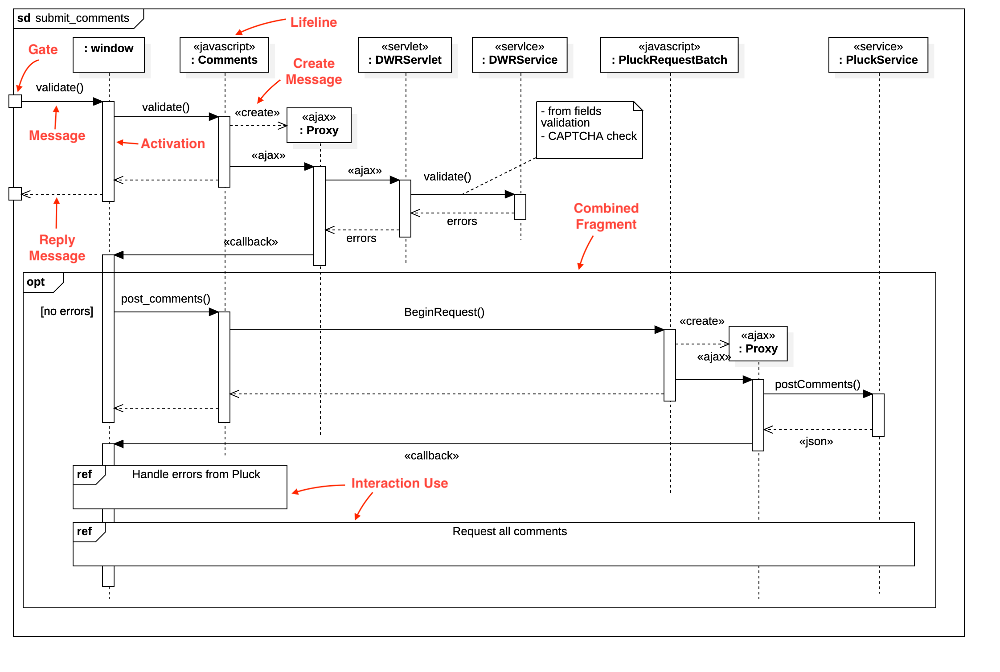

# Sequence Diagram



## Create Sequence Diagram

To create a Sequence Diagram:

1. Select first an element where a new Sequence Diagram to be contained as a child.
2. Select **Model \| Add Diagram \| Sequence Diagram** in Menu Bar or select **Add Diagram \| Sequence Diagram** in Context Menu.

> **See also**
>
> [UML Sequence Diagram](http://www.uml-diagrams.org/sequence-diagrams.html) - For more information about UML Sequence Diagram.

You can show or hide sequence numbers of messages. To show or hide sequence numbers of message:

1. Check or Uncheck `showSequenceNumber` property of **Sequence Diagram** or **Communication Diagram**.

## Lifeline

To create a Lifeline:

1. Select **Lifeline** in **Toolbox**.
2. Drag on the diagram as the size of Lifeline.

To create a Lifeline from a Classifier \(Class, Interface, etc.\) by Drag-and-Drop:

1. Drag a Classifier from **Explorer**.
2. Drop on the diagram.

You can use **QuickEdit** for Lifeline by double-click or press `Enter` on a selected Lifeline.

* **Lifeline Expression** : Edit lifeline expression.

  _Syntax of Lifeline Expression_

  ```text
  lifeline ::= [ '<<' stereotype `>>` ] [ visibility ] name [ '[' selector ']' ] [ ':' type ]
  stereotype ::= (identifier)
  visibility ::= '+' | '#' | '-' | '~'
  name ::= (identifier)
  selector ::= (string)
  type ::= (identifier)
  ```

* **Visibility** : Change visibility property.
* **Add Note** : Add a linked note.
* **Add Constraint** : Add a constraint.
* **Select Type** : Select a type of the lifeline.
* **Create Type** : Create a Class as a type of the lifeline.
* **Add Message with Lifeline** : Add a message with a lifeline.
* **Add Create Message with Lifeline** : Add a create message with a lifeline.
* **Add Self Message** : Add a self message.
* **Add Found Message** : Add a found message.
* **Add Lost Message** : Add a lost message.
* **Add Message from Gate** : Add a message from a gate.
* **Add Message to Gate** : Add a message to a gate.

## Message

To create a Message \(or Self Message\):

1. Select **Message** \(or **Self Message**\) in **Toolbox**.
2. Drag from a Lifeline and drop on another Lifeline. \(Just click on a Lifeline if you want to create a self message.\)

You can change the kind of message by setting `messageSort` property in **Property Editor**:

* `synchCall` : Synchronous Call
* `asynchCall` : Asynchronous Call
* `asynchSignal` : Asynchronous Signal
* `createMessage` : Create Message
* `deleteMessage` : Delete Message
* `reply` : Reply Message

You can use custom sequence numbers instead of auto-generated integer sequence numbers.

1. Enter sequence number for each Message's `sequenceNumber` property.
2. Change `sequenceNumbering` property of **Sequence Diagram** or **Communication Diagram** to `custom`.

You can use **QuickEdit** for Message by double-click or press `Enter` on a selected Message.

* **Message Expression** : Edit message expression.

  _Syntax of Message Expression_

  ```text
  message ::= [ '<<' stereotype `>>` ] [ visibility ] [ target '=' ] name [ '(' arguments ')' ]
  stereotype ::= (identifier)
  visibility ::= '+' | '#' | '-' | '~'
  target ::= (identifier)
  name ::= (identifier)
  arguments ::= (string)
  ```

* **Visibility** : Change visibility property.
* **Add Note** : Add a linked note.
* **Add Constraint** : Add a constraint.
* **Select Operation** : Select an operation as a signature of the message.
* **Create Operation** : Create an operation as a signature of the message.
* **Select Signal** : Select a signal as a signature of the message.
* **Create Signal** : Create a signal as a signature of the message.
* **Add Reply Message** : Add a reply message.

## Endpoint

To create an Endpoint:

1. Select **Endpoint** in **Toolbox**.
2. Click at the position on the diagram.

## Gate

To create a Gate:

1. Select **Gate** in **Toolbox**.
2. Click at the position on the diagram.

## State Invariant

To create a State Invariant:

1. Select **State Invariant** in **Toolbox**.
2. Click on a Lifeline where the State Invariant to be attached.

You can use **QuickEdit** for State Invariant by double-click or press `Enter` on a selected State Invariant.

* **Invariant** : Edit invariant property.

## Continuation

To create a Continuation:

1. Select **Continuation** in **Toolbox**.
2. Drag on the diagram as the size of Continuation.

You can use **QuickEdit** for Model Element \(See [Model Element](class-diagram.md#model-element)\).

## Combined Fragment

To create a Combined Fragment:

1. Select **Combined Fragment** in **Toolbox**.
2. Drag on the diagram as the size of Combined Fragment.

You can change the operator by setting `interactionOperator` property in **Property Editor**:

* `alt` : alternatives
* `opt` : option
* `par` : parallel
* `loop` : iteration
* `critical` : critical region
* `neg` : negative
* `assert` : assertion
* `strict` : strict sequencing
* `seq` : weak sequencing
* `ignore` : ignore
* `consider` : consider
* `break` : break

You can use **QuickEdit** for Combined Fragment by double-click or press `Enter` on a selected Combined Fragment.

* **Name Expression** : Edit name expression.

  _Syntax of Name Expression_

  ```text
  expression ::= [ '<<' stereotype `>>` ] [ visibility ] name
  stereotype ::= (identifier)
  visibility ::= '+' | '#' | '-' | '~'
  name ::= (identifier)
  ```

* **Add Operand** : Add an interaction operand.

## Interaction Operand

You can use **QuickEdit** for Interaction Operand by double-click or press `Enter` on a selected Interaction Operand.

* **Guard** : Edit guard property.

## Interaction Use

To create a Interaction Use:

1. Select **Interaction Use** in **Toolbox**.
2. Drag on the diagram as the size of Interaction Use.

